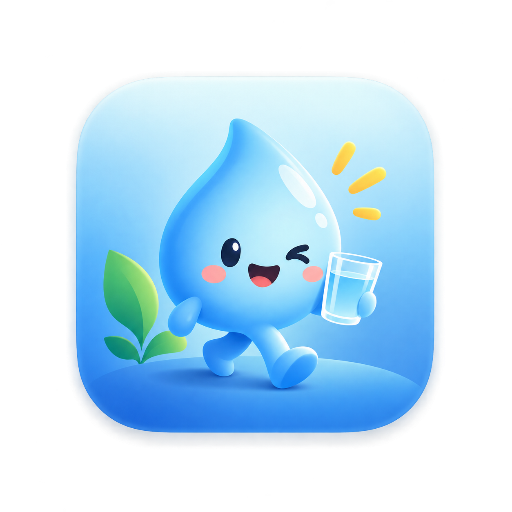

<p align="center">
  
</p>

<h1 align="center">Sipling</h1>

<p align="center">
  A friendly desktop companion that reminds you to drink water. A little water-drop buddy
  walks onto your screen, above every app, and waits with a glass until you tap
  <strong>“I drank it”</strong> or <strong>Snooze</strong>.
</p>

<p align="center">
  
  
  
</p>

---

## What it does

Sipling lives in your menu bar or system tray. On a schedule you set, its avatar walks in from
a screen corner with a speech bubble and a couple of buttons, then waits there until you act. It
does not nag in the background, and the rest of your screen stays clickable while it waits.

- **Walk-across buddy.** A frameless, transparent, click-through overlay floats above every app,
  including fullscreen ones. Only the buddy captures the mouse.
- **Periodic reminders.** A fixed gap you choose, such as every two hours, inside the active
  hours you set, so it stays quiet overnight.
- **Daily goal and counter.** Track glasses and get a nudge when you reach the goal.
- **Pick your sound.** Choose a notification chime (Cute Twinkle, Positive Twinkle, Double Tone)
  and preview it before saving.
- **Your own avatar.** Drop an `avatar.mp4`, `.webm`, or `.gif` into `assets/` and Sipling uses
  it automatically. Without one it falls back to the app logo.
- **Auto-updates** from GitHub Releases in packaged builds.

## Download

Grab the latest build from the [Releases](https://github.com/manthanmk66/Sipling/releases) page.

- **macOS** — `Sipling.dmg`, universal for Apple Silicon and Intel.
- **Windows** — `Sipling.exe` installer, x64 and arm64.

Builds are currently unsigned. On first launch macOS may say the app is from an unidentified
developer; right-click the app and choose **Open**, or allow it under *System Settings → Privacy
& Security*. Signing and notarization need an Apple Developer account.

## Run from source

```bash
git clone https://github.com/manthanmk66/Sipling.git
cd Sipling
npm install
npm start
```

Sipling boots into your menu bar and opens a Settings window. Use the tray icon to preview the
buddy (**Remind me now**) or to configure it (**Settings…**).

## Add your avatar

Save your animated avatar as `assets/avatar.mp4` (or `.webm` / `.gif`) and Sipling picks it up on
the next reminder. A transparent `.webm` gives a no-box floating buddy. See
[assets/README.md](assets/README.md) for tips and for how to add more notification sounds.

## Build and release

Installers are built with [electron-builder](https://www.electron.build/). Auto-update pulls from
this repo's GitHub Releases.

Locally:

```bash
npm run dist:mac   # dist/Sipling.dmg + Sipling.zip   (run on macOS)
npm run dist:win   # dist/Sipling.exe                 (run on Windows)
```

Through CI, which builds both platforms for you: push a version tag and the
[release workflow](.github/workflows/release.yml) builds macOS and Windows, then attaches the
installers to a GitHub Release.

```bash
npm version patch
git push --follow-tags
```

## Project layout

```
src/
  main.js        Electron main process: tray, scheduling, overlay, IPC
  preload.js     Bridge to the renderer (contextIsolation)
  store.js       JSON config store in userData (no deps)
  updater.js     electron-updater wiring (GitHub Releases)
  tokens.css     Design tokens: the Hydro theme (OKLCH, Fredoka + Nunito)
  overlay.*      Fullscreen click-through overlay, the walk-across buddy
  settings.*     The settings window
scripts/
  generate-tray-icon.cjs   Draws the menu-bar template icon (no deps)
assets/          Logo, avatar, notification sounds, fonts, generated icons
build/           electron-builder resources (icon, mac entitlements)
site/            Static landing and download page
.github/         CI and release workflows
```

## License

[MIT](LICENSE) © 2026 Manthan Reddy
